# 🤖 Regexonomics

Chatbot sederhana berbasis **Node.js** dengan dukungan **Regex NLP** yang diintegrasikan ke **Discord**, serta logging menggunakan **Winston**. Projek ini dibuat untuk pembelajaran chatbot rule-based dengan pola tanya-jawab terkait investasi dan berbagai instrumennya yang mudah dikembangkan.

---

## ⚙️ Setup & Run

### 1. Clone Repository
```

git clone https://github.com/Aryok23/regex-chatbot-nlp-2025.git

cd regex-chatbot-nlp-2025
```

### 2. Install Dependencies
```
npm install
```

### 3. Konfigurasi .env

Buat file ```.env``` di root project berdasarkan ```.env.example```

```DISCORD_TOKEN=your_discord_bot_token```

🔑 Cara Mendapatkan Discord Bot Token

#### 1. Buka Developer Portal Discord
👉 https://discord.com/developers/applications

#### 2. Login dengan akun Discord kamu.

#### 3. Buat Aplikasi Baru
- Klik tombol “New Application”
- Beri nama (misalnya: RegexChatbot)
- Klik Create

#### 4. Buat Bot di dalam aplikasi itu
- Di menu sebelah kiri, pilih “Bot”
- Klik tombol “Add Bot”
- Konfirmasi dengan klik Yes, do it!

#### 5. Salin Token Bot
- Masih di halaman Bot, ada bagian Token
- Klik “Reset Token” (kalau belum pernah dibuat)
- Klik “Copy” → inilah DISCORD_TOKEN yang kamu masukkan ke file .env

⚠️ Jangan pernah commit token asli ke GitHub.

### 4. Integrasi dengan Discord
- Masuk ke menu Bot, scroll ke bagian Privileged Gateway Intents.
- Aktifkan: ✅ MESSAGE CONTENT INTENT, (opsional kalau perlu) PRESENCE INTENT & SERVER MEMBERS INTENT
- Klik Save Changes.
- Masuk ke menu “OAuth2 → URL Generator”
- Centang (minimal):
  - bot (di bagian SCOPES)
  - Send Messages + Read Messages/View Channels (di bagian BOT PERMISSIONS)
- Copy URL yang muncul, buka di browser, pilih server Discord kamu, klik Authorize.

---

## 📸 Demo
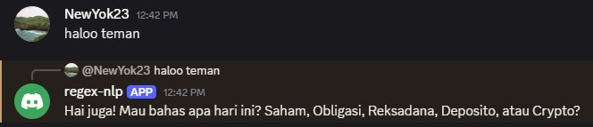

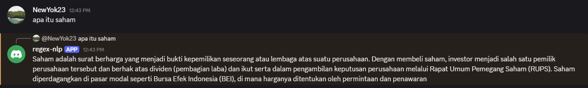

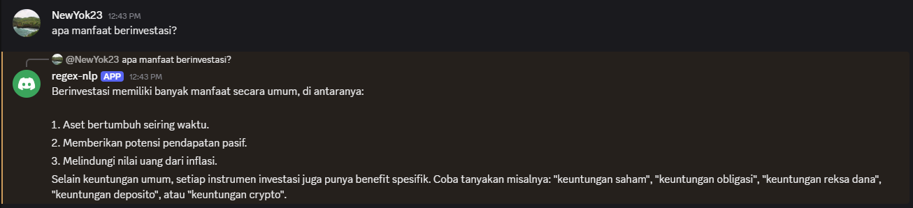

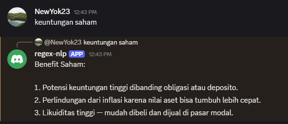

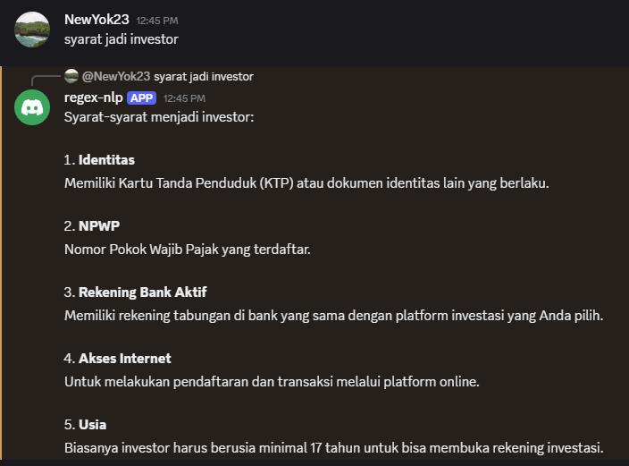

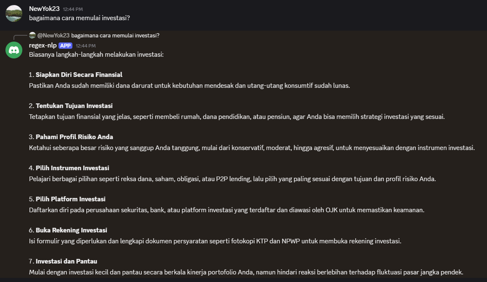

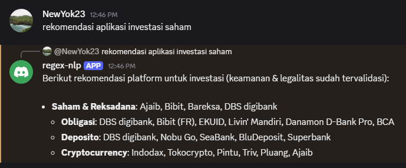

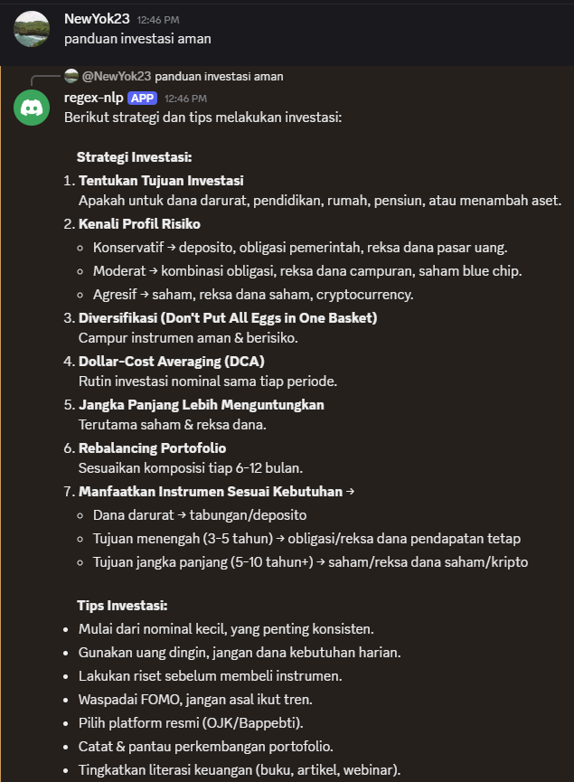

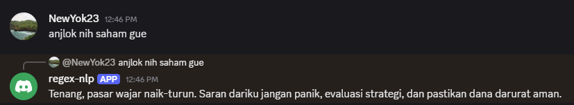

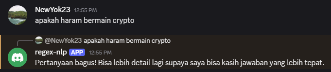

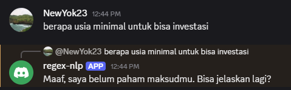
